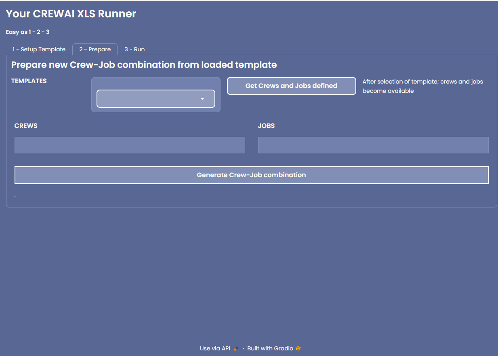
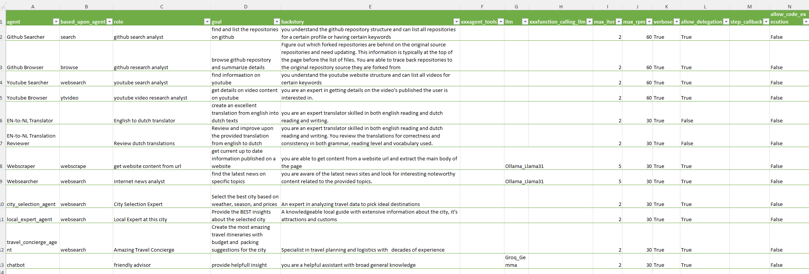

# CrewAI excel xls template runner

## Intro
This repository contains code to load CrewAI configuration using Gradio UI from Excel xls and generate the Python code for a crew-job combination. A job is a sequence of tasks. 
The source of the crews is defined in the xls. It allows for quick prototyping and iterations without having to edit code,
There is a set of basic agents which have tools defined. This is only a subset of what currently is available through crewai tools. 

## Prerequisites

### CrewAI
CrewAI is a framework for managing and executing tasks using AI agents. It allows for quick prototyping and iterations without having to edit code.
A new clean requirements.txt is generated; command is in .sh file

#### CrewAI package
Default pip install of the package

#### Tools
Default install of the crewai tools

#### Langchain
Langchain is a library for building applications with language models. It provides tools for managing and orchestrating language model interactions.
Other langchain packages that are used are listed in requirements.txt

### XLS
Excel format is xlsx, list of sheets are read and loaded.
The actual preparation of the crews is done beforehand as the crew details do not change much once developed.

### API Keys
API keys need to be provided as part of the environment, both running straight from source and when using docker container eg when hosting on render.com

## Docker Setup

The application is containerized using Docker. Below are the key configurations and steps to build and run the Docker container:

- **Base Image**: The application uses a slim version of Python 3.10.13 as the base image.
- **Environment Variables**:
  - `PYTHONDONTWRITEBYTECODE=1`: Prevents Python from writing `.pyc` files.
  - `PYTHONUNBUFFERED=1`: Ensures that Python output is not buffered, which is useful for logging.
- **Working Directory**: The application code is located in the `/app` directory within the container.
- **Dependencies**: Dependencies are installed from `requirements.txt` using `pip`.
- **Port**: The application listens on port `8000`.
- **Command**: The application is run using Uvicorn with the command:
  ```
  CMD ["python", "-m", "uvicorn", "main:app", "--proxy-headers", "--host", "0.0.0.0", "--port", "8000", "--reload"]
  ```

### Run locally
First, get the project dependencies installed
 
`pip install -r requirements.txt`

just run locally as
`python3 main.py`

and follow the gradio instructions on screen to open your browser and use the UI.

## Makefile Commands

The `Makefile` provides several commands to manage Docker containers and the development environment:

- **build**: Builds the Docker image with the default image name `crew-ai-xls`.
- **run**: Runs the Docker container, stopping and removing any existing container with the same name.
- **stop**: Stops the running Docker container.
- **rm**: Removes the Docker container.
- **logs**: Follows the logs from the running Docker container.
- **rerun**: Stops, removes, rebuilds, and runs the Docker container.
- **clean**: Cleans up all unused Docker images and containers.
- **conda**: Activates the specified Conda environment. This is useful for managing dependencies in a consistent environment.
- **pyrun**: Runs the application using Uvicorn for local development. This command is useful for testing the application locally before deploying.
- **reqs**: Generates a `requirements.txt` file using `pipreqs`.
To allow easy deployment a docker image is provided;

### Building and running your application

When you're ready, start your application by running:
`docker compose up --build`.

Your application will be available at http://localhost:8000.

### Deploying your application to the cloud

First, build your image, e.g.: `docker build -t myapp .`.
If your cloud uses a different CPU architecture than your development
machine (e.g., you are on a Mac M1 and your cloud provider is amd64),
you'll want to build the image for that platform, e.g.:
`docker build --platform=linux/amd64 -t myapp .`.

Then, push it to your registry, e.g. `docker push myregistry.com/myapp`.

Consult Docker's [getting started](https://docs.docker.com/go/get-started-sharing/)
docs for more detail on building and pushing.

### References
* [Docker's Python guide](https://docs.docker.com/language/python/)

## Screenshots

### Browser GradioUI

#### Optional Step 1 Downloading and uploading xls template files


#### Optional Step 2
##### Select xls configuration


##### Select a crew and job combination to generate crew for


#### Straight to Step 3 if nothing changed in xls
##### Select job to run from generated crews


##### Job is selected and default prompt is provided


##### Provide specific additional inputs


##### Wait for final results and see detailed logging


### Excel xls
The excel file contains the complete setup to run a crew.
Please note , not all parameters are implemented yet, but most are and up-to-date with version 0.41 from crewAI.
> Supporting additonal parameters entails adding the column, matching the name to the template {variable} taking care of quoteds strings when needed. If something more fancy is needed, you have to either add to the generate_crew code, or within the class constructor. 

#### LLM providers and models
Defining the providers and available models.
The templates/llm_class_template.py has the import statement for the provider.
To support additional providers, you need to add these to the class template, additional models for already configured providders, you only need to add a row in the xls sheet with the details.


#### Jobs to be done and task definitions
To stick to crewAI terminology, a job is a collection of tasks


> The xls contains the trip planner example, other jobs and tasks are development test cases, not necessarily working well.

#### Crews and crewmembers
Crews are defined to tackle specific jobs.
Agens have the tools and are assebled into crews.





